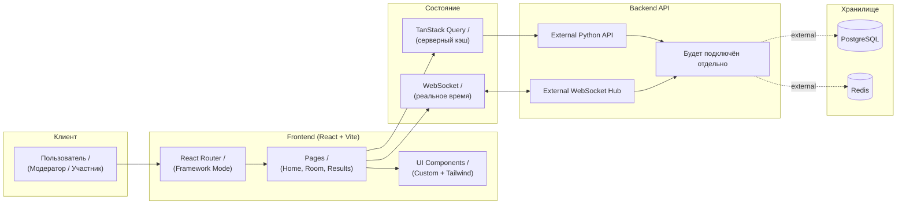

<div align="center">

# Poker Planning

**Инструмент для проведения планирования покером в реальном времени**

[](https://react.dev/)
[](https://vite.dev/)
[](https://www.typescriptlang.org/)
[](https://tailwindcss.com/)

</div>

---

## Содержание

- [О проекте](#о-проекте)
- [Технологический стек](#технологический-стек)
- [Текущее состояние](#текущее-состояние)
- [Архитектура](#архитектура)
- [Быстрый старт](#быстрый-старт)
- [Команды](#команды)
- [Форматирование и стили](#форматирование-и-стили)

---

## О проекте

### Проблема

Проведение планирования покером в распределённых командах требует синхронизации участников, ручного подсчёта карт и часто приводит к рассинхрону при голосовании.

### Решение

**Poker Planning** — веб-приложение для оценки задач методом Planning Poker. Команда создаёт комнату, участники голосуют картами в реальном времени через WebSocket, результаты синхронизируются мгновенно для всех участников.

### Аудитория

- Разработчики
- Scrum-команды
- Тимлиды

---

## Технологический стек

<div align="center">

|      **Категория**       |                                    **Технологии**                                     |        **Версия / Детали**         |
| :----------------------: | :-----------------------------------------------------------------------------------: | :--------------------------------: |
|       UI framework       |                           [React](https://react.dev/learn)                            |                19+                 |
|           Язык           |                  [TypeScript](https://www.typescriptlang.org/docs/)                   |                 5+                 |
|          Сборка          |                            [Vite](https://vite.dev/guide/)                            |                 6+                 |
|         Роутинг          | [React Router (Framework Mode)](https://reactrouter.com/start/framework/installation) |                 7+                 |
|     Серверный стейт      |   [TanStack Query](https://tanstack.com/query/latest/docs/framework/react/overview)   |                 5+                 |
|          Стили           |         [Tailwind CSS](https://tailwindcss.com/docs/installation/using-vite)          |                 4+                 |
|       HTTP-клиент        |                      [Axios](https://axios-http.com/docs/intro)                       |               1.13+                |
|         Realtime         |        [WebSocket](https://developer.mozilla.org/en-US/docs/Web/API/WebSocket)        |      нативный браузерный API       |
|     Документация API     |                     [Swagger / OpenAPI](https://swagger.io/docs/)                     | спецификация и описание контрактов |
|       Методология        |                [Feature-Sliced Design](https://feature-sliced.design/)                |     организация frontend-кода      |
|     Контроль версий      |                            [Git](https://git-scm.com/doc)                             |        workflow разработки         |
| Линтинг и форматирование |                             ESLint + Prettier + Stylelint                             |     инструменты качества кода      |

</div>

---

## Текущее состояние

- Монорепозиторий настроен для `frontend` и `packages/shared`.
- Backend в этом репозитории не подготавливается: будет подключён отдельный готовый Python-сервис.
- Подготовлены общие конфиги качества кода: ESLint, Prettier, Stylelint, TypeScript base config, Turbo.

---

## Архитектура



---

## Быстрый старт

### Требования

<div align="center">

| Компонент | Минимум | Рекомендуется |
| :-------: | :-----: | :-----------: |
|  Node.js  | 18.18+  |      20+      |
|   pnpm    |   8+    |      9+       |

</div>

### Клонирование репозитория

```bash
git clone https://github.com/your-org/poker-planning.git

cd poker-planning
```

### Установка зависимостей

```bash
pnpm install
```

### Запуск приложения

```bash
pnpm dev
```

### Настройки по умолчанию

- Frontend: `http://localhost:5173`
- Backend API (будет внешним): `http://localhost:8000`
- WebSocket (будет внешним): `ws://localhost:8000/ws`

---

## Команды

### Root (monorepo)

```bash
# Запуск dev-задач во всех пакетах
pnpm dev

# Сборка всех пакетов
pnpm build

# Линтинг всех пакетов
pnpm lint

# Автоисправление линтинга + форматирование
pnpm lint:fix

# Только ESLint (проверка / автоисправление)
pnpm lint:eslint
pnpm lint:eslint:fix

# Только Stylelint (проверка / автоисправление)
pnpm lint:style
pnpm lint:style:fix

# Проверка типов
pnpm typecheck

# Автоформатирование всего репозитория
pnpm format

# Проверка форматирования без изменений файлов
pnpm format:check
```

### Frontend (targeted)

```bash
# Запуск только frontend
pnpm --filter @poker/frontend dev

# Сборка только frontend
pnpm --filter @poker/frontend build

# Предпросмотр production-сборки frontend
pnpm --filter @poker/frontend preview

# Линтинг frontend
pnpm --filter @poker/frontend lint

# Только ESLint frontend
pnpm --filter @poker/frontend lint:eslint
pnpm --filter @poker/frontend lint:eslint:fix

# Только Stylelint frontend
pnpm --filter @poker/frontend lint:style
pnpm --filter @poker/frontend lint:style:fix

# Форматирование только frontend/src
pnpm --filter @poker/frontend format
pnpm --filter @poker/frontend format:check
```
