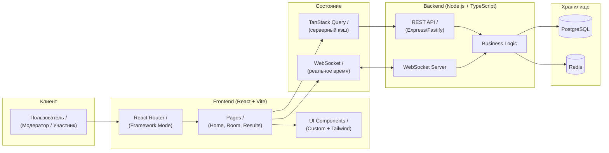

<div align="center">

# Poker Planning

**Инструмент для проведения планирования покером в реальном времени**

[](https://react.dev/)
[](https://vite.dev/)
[](https://www.typescriptlang.org/)
[](https://tailwindcss.com/)
[](https://nodejs.org/)
[](https://www.postgresql.org/)

</div>

---

## Содержание

- [О проекте](#о-проекте)
- [Технологический стек](#технологический-стек)
- [Текущее состояние](#текущее-состояние)
- [Архитектура](#архитектура)
- [Структура монорепозитория](#структура-монорепозитория)
- [Быстрый старт](#быстрый-старт)
- [Docker 🐳](#docker-)
- [Команды](#команды)
- [Форматирование и стили](#форматирование-и-стили)

---

## О проекте

### Проблема

Проведение планирования покером в распределённых командах требует синхронизации участников, ручного подсчёта карт и часто приводит к рассинхрону при голосовании.

### Решение

**Poker Planning** — веб-приложение для оценки задач методом Planning Poker. Команда создаёт комнату, участники голосуют картами в реальном времени через WebSocket, результаты синхронизируются мгновенно для всех участников.

### Аудитория

- Разработчики
- Scrum-команды
- Тимлиды

---

## Технологический стек

### Frontend

<div align="center">

|      **Категория**       |                                    **Технологии**                                     |        **Версия / Детали**         |
| :----------------------: | :-----------------------------------------------------------------------------------: | :--------------------------------: |
|       UI framework       |                           [React](https://react.dev/learn)                            |                19+                 |
|           Язык           |                  [TypeScript](https://www.typescriptlang.org/docs/)                   |                 5+                 |
|          Сборка          |                            [Vite](https://vite.dev/guide/)                            |                 6+                 |
|         Роутинг          | [React Router (Framework Mode)](https://reactrouter.com/start/framework/installation) |                 7+                 |
|     Серверный стейт      |   [TanStack Query](https://tanstack.com/query/latest/docs/framework/react/overview)   |                 5+                 |
|          Стили           |         [Tailwind CSS](https://tailwindcss.com/docs/installation/using-vite)          |                 4+                 |
|       HTTP-клиент        |                      [Axios](https://axios-http.com/docs/intro)                       |               1.13+                |
|         Realtime         |        [WebSocket](https://developer.mozilla.org/en-US/docs/Web/API/WebSocket)        |      нативный браузерный API       |
|     Документация API     |                     [Swagger / OpenAPI](https://swagger.io/docs/)                     | спецификация и описание контрактов |
|       Методология        |                [Feature-Sliced Design](https://feature-sliced.design/)                |     организация frontend-кода      |
|     Контроль версий      |                            [Git](https://git-scm.com/doc)                             |        workflow разработки         |
| Линтинг и форматирование |                             ESLint + Prettier + Stylelint                             |     инструменты качества кода      |

</div>

### Backend

<div align="center">

|    **Категория**    |                   **Технологии**                    | **Версия** |
| :-----------------: | :-------------------------------------------------: | :--------: |
|        Язык         |          [Python](https://www.python.org/)          |   3.13+    |
|   HTTP-фреймворк    |      [FastAPI](https://fastapi.tiangolo.com/)       |  0.115.12  |
|     ASGI-сервер     |         [Uvicorn](https://www.uvicorn.org/)         |   0.34.0   |
|         ORM         |      [SQLAlchemy](https://www.sqlalchemy.org/)      |   2.0.40   |
|     Миграции БД     |     [Alembic](https://alembic.sqlalchemy.org/)      |   1.15.2   |
|     База данных     |   [PostgreSQL](https://www.postgresql.org/docs/)    |     16     |
|     Драйвер БД      |         [psycopg](https://www.psycopg.org/)         |   3.2.6    |
|   Валидация схем    |       [Pydantic](https://docs.pydantic.dev/)        |   2.11.3   |
|   Аутентификация    |       [PyJWT](https://pyjwt.readthedocs.io/)        |   2.10.1   |
| Хеширование паролей | [pwdlib](https://github.com/pwdlib/pwdlib) (argon2) |   latest   |

</div>

---

## Текущее состояние

- Монорепозиторий настроен для `frontend` (TypeScript/React) и `packages/shared` (TypeScript).
- Backend (`apps/backend`) — отдельный Python проект на FastAPI с собственным workflow.
- Frontend: React 19 + Vite 6 + TypeScript + Tailwind CSS 4.
- Backend: FastAPI 0.115 + SQLAlchemy 2.0 + Alembic + PostgreSQL 16.
- Shared package: общие типы и утилиты для frontend.
- Подготовлены общие конфиги качества кода: ESLint, Prettier, Stylelint, TypeScript base config, Turbo.

---

## Архитектура



---

## Структура монорепозитория

```
poker-planning/
├── apps/
│   ├── frontend/           # React frontend приложение (TypeScript)
│   │   ├── src/
│   │   ├── package.json
│   │   └── ...
│   └── backend/            # FastAPI backend сервис (Python)
│       ├── app/
│       │   ├── api/        # REST API routes
│       │   ├── core/       # Config, security, dependencies
│       │   ├── db/         # Database session, base models
│       │   ├── models/     # SQLAlchemy ORM models
│       │   ├── repositories/  # Data access layer
│       │   ├── schemas/    # Pydantic DTO schemas
│       │   ├── services/   # Business logic
│       │   └── websocket/  # WebSocket manager
│       ├── alembic/        # Database migrations
│       ├── requirements.txt
│       ├── Dockerfile
│       └── docker-compose.yml
├── packages/
│   └── shared/             # Общие типы и утилиты (TypeScript)
│       ├── src/
│       ├── package.json
│       └── tsconfig.json
├── docs/                   # Документация проекта
├── infrastructure/         # Docker, CI/CD, деплой
├── package.json            # Root package.json (pnpm scripts)
├── pnpm-workspace.yaml     # pnpm workspace конфигурация
├── turbo.json              # Turbo monorepo конфигурация
├── tsconfig.base.json      # Базовый TypeScript конфиг
├── eslint.config.mjs       # ESLint конфигурация
├── prettier.config.cjs     # Prettier конфигурация
├── stylelint.config.cjs    # Stylelint конфигурация
└── .editorconfig           # EditorConfig
```

---

## Быстрый старт

### Требования

<div align="center">

| Компонент | Минимум | Рекомендуется |
| :-------: | :-----: | :-----------: |
|  Node.js  | 18.18+  |      20+      |
|   pnpm    |   8+    |      9+       |

</div>

### Клонирование репозитория

```bash
git clone https://github.com/your-org/poker-planning.git

cd poker-planning
```

### Установка зависимостей

```bash
pnpm install
```

### Запуск приложения

```bash
pnpm dev
```

---

## Команды

### Root (monorepo)

```bash
# Запуск dev-задач (только frontend, т.к. backend на Python)
pnpm dev

# Запуск только frontend
pnpm dev:frontend

# Сборка всех пакетов
pnpm build

# Сборка только frontend
pnpm build:frontend

# Линтинг всех пакетов
pnpm lint

# Автоисправление линтинга + форматирование
pnpm lint:fix

# Только ESLint (проверка / автоисправление)
pnpm lint:eslint
pnpm lint:eslint:fix

# Только Stylelint (проверка / автоисправление)
pnpm lint:style
pnpm lint:style:fix

# Проверка типов
pnpm typecheck

# Автоформатирование всего репозитория
pnpm format

# Проверка форматирования без изменений файлов
pnpm format:check
```

### Frontend (targeted)

```bash
# Запуск только frontend
pnpm --filter @poker/frontend dev

# Сборка только frontend
pnpm --filter @poker/frontend build

# Предпросмотр production-сборки frontend
pnpm --filter @poker/frontend preview

# Линтинг frontend
pnpm --filter @poker/frontend lint

# Только ESLint frontend
pnpm --filter @poker/frontend lint:eslint
pnpm --filter @poker/frontend lint:eslint:fix

# Только Stylelint frontend
pnpm --filter @poker/frontend lint:style
pnpm --filter @poker/frontend lint:style:fix

# Форматирование только frontend/src
pnpm --filter @poker/frontend format
pnpm --filter @poker/frontend format:check
```

### Backend (Python/FastAPI)

```bash
# Переход в папку backend
cd apps/backend

# Создание виртуального окружения
python3 -m venv .venv
source .venv/bin/activate  # Linux/macOS

# Установка зависимостей
pip install -r requirements.txt

# Запуск в режиме разработки
uvicorn app.main:app --reload --host 0.0.0.0 --port 8000

# Миграции БД
alembic upgrade head

# Запуск через Docker Compose
docker compose up
```

### Docker

```bash
# Просмотр статуса контейнеров
docker-compose ps

# Просмотр логов
docker-compose logs -f

# Остановка всех сервисов
docker-compose down

# Полная очистка (удалить всё)
docker-compose down -v
```
